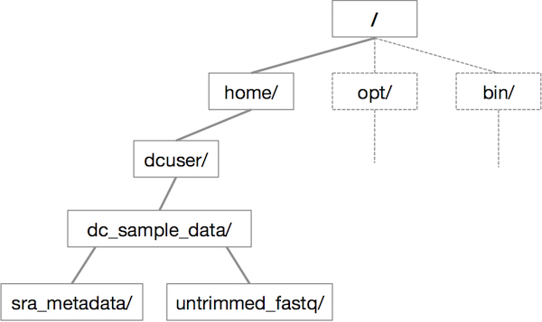

## Learning objectives

* Navigate around the Unix file system
* Explore the content of files
* Learn how to manipulate files


## Starting with the shell

Now that we are connected to the cloud, we have file directories available to us to explore. Let's learn a few commands by investigating the folders in the `dc_sample_data` directory:

```bash
$ cd dc_sample_data
```

> `cd` stands for 'change directory'

Let's see what is inside the folder. Type:

```bash
$ ls
```

You will see:

    sra_metadata  untrimmed_fastq


> `ls` stands for 'list' and it lists the contents of a directory.

There are two items listed.  What are they? We can use a command line "modifier" with `ls` to get more information; this modifier is called an argument (more below).

```bash
$ ls -F
```
        sra_metadata/  untrimmed_fastq/

Anything with a "/" after it is a directory. Things with a "*" after them are programs. If there are no decorations after the name, it's a file.

You can also use the command `ls -l` to see whether items in a directory are files or directories. 

```bash
$ ls -l
```

    drwxr-x--- 2 dcuser dcuser 4096 Jul 30 11:37 sra_metadata
    drwxr-xr-x 2 dcuser dcuser 4096 Jul 30 11:38 untrimmed_fastq

`ls -l` gives a lot more information too.

Let's go into the `untrimmed_fastq` directory and see what is in there.

```bash
$ cd untrimmed_fastq

$ ls -F
```

    SRR097977.fastq  SRR098026.fastq

There are two items in this directory with no trailing slashes, so they are files.

### Arguments

Most commands take additional arguments that control their exact
behavior. For example, `-F` and `-l` are arguments to `ls`.  The `ls`
command, like many commands, takes a lot of arguments. Another useful one is '-a',
which shows everything, including hidden files.

How do we know what arguments are available for particular commands? Most commonly used shell commands have a manual. You can access the
manual using the `man` command. Try entering:

```bash
$ man ls
```

This will open the manual page for `ls`. Use the `space key` to go forward and `b` to go backwards. When you are done reading, just hit `q` to quit.

Commands that are run from the shell can get extremely complicated. To see an example, open up the manual page for the `find` command. No one can possibly learn all of these arguments, of course. So you will probably find yourself referring to the manual page frequently.

> If the manual page within the terminal is hard to read and traverse, the manual exists online, use your web searching powers to get it! In addition to the arguments, you can also find good usage examples online; Google is your friend.

## The Unix directory file structure (a.k.a. where am I?)

As you've already just seen, you can move around in different directories
or folders at the command line. You are probably accustomed to navigating around the normal way using a GUI (GUI = Graphical User Interface, pronounced *gooey*), but you will find that it's not too difficult once you get the hang of it.

### Moving around the file system

Let's practice moving around a bit. Previously, we moved to the `untrimmed_fastq` directory.

To get there, we first changed directories from the folder of our username (dcuser) to
`dc_sample_data` then we changed directories to `untrimmed_fastq`

Let's draw out how that went.

Now let's draw some of the other files and folders we could have clicked on.

This is called a hierarchical file system structure, like an upside down tree
with root (/) at the base that looks like this:



That root (/) is often also called the 'top' level.

When you are working at your computer or log in to a remote computer,
you are on one of the branches of that tree, your home directory (/home/dcuser)

Now let's go do that same navigation at the command line.

Type:

```bash
$ cd
```

This puts you in your home directory. No matter where you are in the directory system, `cd` will always bring you back to your home directory.

Now using `cd` and `ls`, go in to the `untrimmed_fastq` directory and list its contents.

Let's also check to see where we are. Sometimes when we're wandering around
in the file system, it's easy to lose track of where we are and get lost.

If you want to know what directory you're currently in, type:

```bash
$ pwd
```

This stands for 'print working directory'. The directory you're currently working in.

What if we want to move back up and out of the 'untrimmed_fastq' directory? Can we just
type `cd dc_sample_data`? Try it and see what happens.

To go 'back up a level' we need to use `..`

Type

```bash
$ cd ..
```
